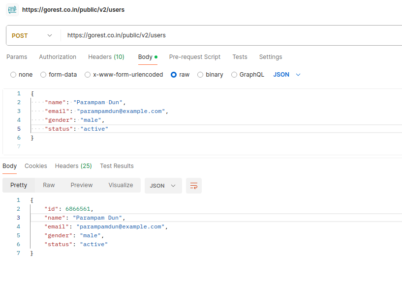
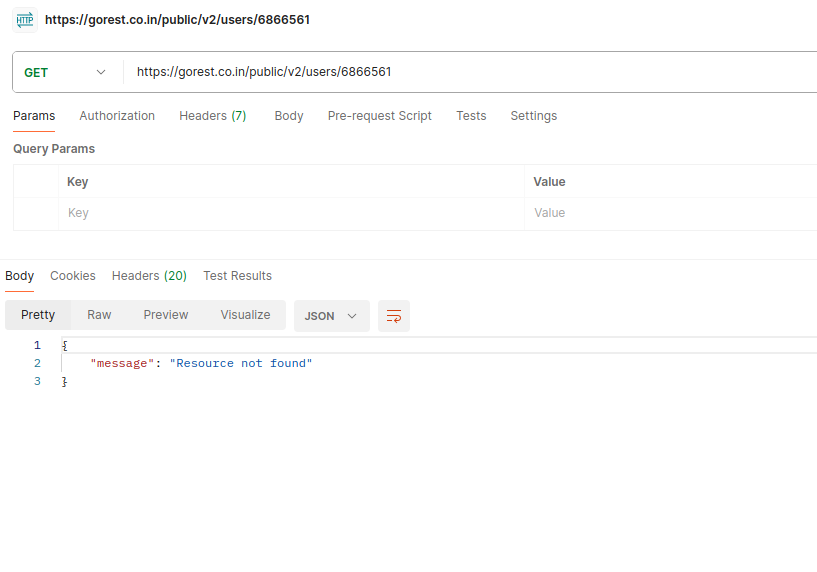

# Blog App

powered by:


This is a blog app created with [Next.js](https://nextjs.org/) using [`create-next-app`](https://github.com/vercel/next.js/tree/canary/packages/create-next-app). and also using dummy data from [Go REST](https://gorest.co.in/). It contains certain main page such as posts page and users page and profile.

## Key Features

- Viewing Posts with it's detail such as user and the comments
- Viewing Post's comments right bellow the post
- User search and CRUD operation
- Responsive styling

## Instalation

First, download or fork this repository to get the project's resources and dependencies.

```
https://github.com/muhAzis/blog-app.git
```

Then, install all the packages needed:

```bash
npm install
# or
yarn install
#or
pnpm install
#or
bun install
```

Before running the app, because this app is using API provider for getting the data and because this app includes CRUD operation to the provider it needs an API key. You can get the API key [here](https://gorest.co.in/my-account/access-tokens) and then store it inside `.env.local` with the following name:

```
NEXT_PUBLIC_API_KEY
```

Make sure the API key is inserted correctly, and then run the development server:

```bash
npm run dev
# or
yarn dev
# or
pnpm dev
# or
bun dev
```

Open [http://localhost:3000](http://localhost:3000) with your browser to see the result.

## Tech

- [[Next JS](https://nextjs.org)] - fast node.js network app framework
- [[React JS](https://react.dev)] - component based Javascript library
- [[Typescript](https://www.typescriptlang.org)] - more strict version of Javascript
- [[Bootstrap Icon](https://icons.getbootstrap.com)] - the streaming build system
- [[SASS](https://sass-lang.com)] - more advance styling language

## NOTES!!!

There are some important notes for this app you should pay attention to!

Apparently, there are some bugs from the API provider.

- ### _Untracked user data_

Because the API provides CRUD operation and basically everyone have access to it, the data didn't handled propperly. For example if we delete a user then all the posts, comments and todos data of that user will remain the same and not given an invalid state.

It causes some posts and comments will still have the creator's detail such as the user_id but it is not found when we look for it.

- ### _Update and Create user bug_

The API provides CRUD operation including Create and Update. But when we request a Create or Update user to the provider it does giving an `ok` response but we can't really find the data we have just created, and the updated data seemed not updated either.

This is an example of creating a new user using Postman:



As shown in the image above, it is a successfull process. The response is giving back the user's detail with additional `id` generated by the provider automatically, which means that this user is added to the server.

But when we try to find the user we just created:



The user is not found.

The cause of this problem is either because of my missunderstanding or it is a bug from the server. I can't really tell because there are not much documentation from the provider.

The important thing is the provider gives an `ok` result which means the request is successfull. I think that is enough for a mini project because it is using someone else's backend, we can't do anything if the problem comes from the server.

## License


